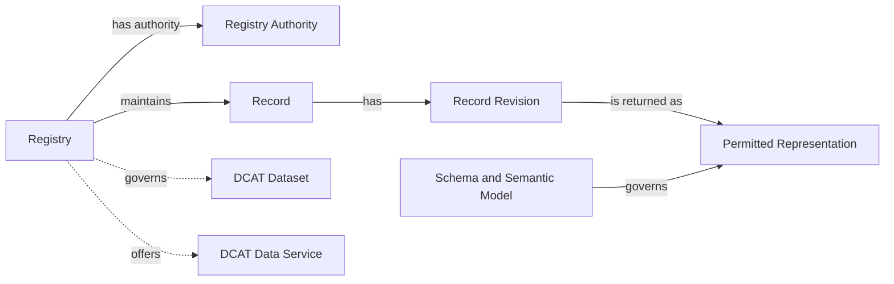

# Registry Core

> **Status:** DRAFT. See [requirement maturity](../04-conformance.md#41-requirement-maturity).

## Purpose and applicability

Registry Core defines the common behaviour and metadata shared by the API families. It identifies the Registry, its authority and scope, and its available services. Returned Records have stable identity within an unambiguous Registry context and a documented representation schema. A capability or domain profile can additionally require revision, lifecycle, provenance, or formal semantic-model information.

Core is the interoperability boundary of this specification. Two implementations that conform to Core and the same capability expose the same operation shapes, error model, pagination, discovery mechanism and Record envelope. They do not expose the same domain fields: each deployment declares its own Record schemas in its published contract, and a domain profile can narrow them. Consumers can reuse protocol and envelope handling across Registries; domain-specific inputs and interpretation still require integration against each published contract.

The [conformance model](../04-conformance.md) combines Core with at least one selected capability. Core requirements apply as follows:

- Registry metadata and service discovery apply to every implementation.
- Record representation requirements apply to implemented capabilities that return Records.
- Identifier preservation applies where the implementation assigns or maintains Record Identifiers.
- The OpenAPI Registry context extension applies to the selected Consultation operations.

[Provisioning](provisioning.md) provides optional administrative operations for creating or revising metadata. Publication can also use a static document or an external catalogue.

## Conceptual model



The model describes externally observable concepts. An implementation can operate one or more Registries, each with one or more technical services.

## Registry metadata

Registry metadata describes the institutionally governed Registry and its relationships to datasets, technical services, and catalogues. An implementation publishes it as one JSON document, as described under [Discovery publication](#discovery-publication). The keys below are defined by the [metadata document schema](../../api/extensions/registry-metadata.schema.json). The [metadata vocabulary appendix](../12-other-resources/metadata-vocabulary.md) explains their DCAT and RDF meaning for catalogue integrators; producing or consuming the document does not require RDF tooling.

### Minimal metadata

| Concept | JSON key | Status | Meaning |
|---|---|---|---|
| Registry Identifier | `@id` of the Registry | Required | Globally unique and stable identifier for the Registry. |
| Registry Name | `title` | Required | Human-readable name used by adopters and consumers. |
| Registry Authority | `authority` | Required | Institution accountable for the Registry and its declared authoritative scope. |
| Digital Registries specification reference | `specification` | Required | Identifies the versioned Digital Registries specification used to describe the implementation. |
| Description and authoritative scope | `description` | Required | Describes the information for which the named authority accepts responsibility, including relevant domain or jurisdictional boundaries. |
| Governed dataset | `governedDataset` | Optional and repeatable | A governed collection of Registry Records described for discovery or exchange. |
| Data service | `dataService` | Required for each exposed Registry service; repeatable | Associates the Registry with each interface exposed through the Digital Registries capability model. |

The scope description states the information for which the Registry Authority accepts responsibility and can reference a fuller scope or mandate document. The Registry Authority, Registry Operator, and catalogue publisher are distinct roles that can be held by the same or different organisations. The adopting ecosystem determines how it accepts or verifies authority declarations. Publication alone does not establish institutional responsibility.

`specification` identifies the specification version used to describe the implementation. A formal claim against an applicable approved specification or profile uses `conformsTo`. [Conformance](../04-conformance.md) defines the conditions for such claims.

### API family discovery

Each service exposed through the Digital Registries capability model identifies its supported API families with `serviceType` values on its data service description. Each value is a concept from the **Digital Registries API Families** scheme, abbreviated by the `apif:` prefix. Declarations cover Registry services available to the metadata's intended audience.

| `serviceType` value | API family |
|---|---|
| `apif:consultation` | Consultation |
| `apif:provisioning` | Provisioning |
| `apif:evidence` | Evidence |
| `apif:write` | Write |
| `apif:notification` | Notification |
| `apif:aggregate-data` | Aggregate Data |
| `apif:access-transparency` | Access Transparency |
| `apif:identity-federation` | Identity Federation |

An API-family value means that the data service exposes at least one operation assigned to that family. Supported operations are defined in the contract linked by `endpointDescription`. Family classification alone establishes neither support for every operation in the family nor a conformance claim.

Service metadata includes the service identifier, family classifications, `endpointURL`, and `endpointDescription`. The linked contract is machine-readable. HTTP operations use OpenAPI, or a protocol-native machine-readable description where the selected binding defines one. Parameters, request and response schemas, outcomes, and access requirements are defined in that contract. The metadata supports service discovery; automatic selection and invocation of equivalent operations across implementations is outside this discovery model.

A service description declares only the families available for its associated Registry. Where a shared API offers different families for different Registries, each Registry uses a separate logical data service description. Those descriptions can share an endpoint or contract URI.

### API composition

One API can expose several Record collections and operations from several families. Its contract documents each collection's membership and each operation's inputs, representation, and access requirements. API-family classifications describe capabilities independently of URL structure.

An OpenAPI contract declares the Registry context of each Consultation operation with the `x-govstack-digital-registries` extension on the Operation Object. The extension carries four values: `registry`, the Registry Identifier, equal to the `@id` of a Registry in the published metadata; `collection`, equal to the collection segment of the operation path; `capability`, one of `retrieve`, `lookup`, `list` and `search`; and `view`, the name of the Record view the operation returns. The [extension schema](../../api/extensions/x-govstack-digital-registries.schema.json) is its normative definition. Operations of one collection that declare the same view return the same Record schema. The extension is the machine-readable link between a Record read and the metadata that identifies its Registry and authority; the [Common Record context](#common-record-context) relies on it.

```yaml
  /v1/businesses/{recordId}:
    get:
      operationId: retrieveBusiness
      x-govstack-digital-registries:
        registry: https://registry.example/registries/business
        collection: businesses
        capability: retrieve
        view: business-public
```

Operations from different families can share a resource URI through distinct HTTP methods. For example, Consultation can retrieve a Record at a URI where Write accepts an update. Each operation defines its own request and response schemas and permissions. The API contract coordinates collection, action, and supporting-resource paths, including any schema, subscription, or asynchronous-operation resources.

The major version applies to the API contract exposed at that root. Separately exposed APIs can evolve under their own versions. Protocol-specific bindings follow their protocol's endpoint and versioning conventions.

### Discovery publication

An implementation publishes its Registry metadata as one document compacted with the version 1 JSON-LD context and served as `application/ld+json`. The [metadata document schema](../../api/extensions/registry-metadata.schema.json) defines the compacted shape; the JSON-LD context defines its RDF meaning for consumers that want it. The [adopter kit](../12-other-resources/adopter-kit.md) lists this document alongside the other published artifacts. The document describes one or more Registries, their governed datasets, and their services. The document URI identifies the document; each Registry has its own Registry Identifier. The document URI is chosen by the deployment, is stable, and is not part of the versioned API surface.

Consumers locate the document through the [RFC 9727](https://www.rfc-editor.org/rfc/rfc9727.html) API catalog. The origin that hosts a Digital Registries API serves `/.well-known/api-catalog` as an [RFC 9264 linkset](https://www.rfc-editor.org/rfc/rfc9264.html) in `application/linkset+json`, following the GET, HEAD, and HTTPS requirements of RFC 9727. For every Digital Registries API at that origin, the linkset carries a `service-desc` link to the OpenAPI contract and a `service-meta` link, typed `application/ld+json`, to the Registry metadata document. Both link relations are defined by [RFC 8631](https://www.rfc-editor.org/rfc/rfc8631.html). The well-known path is one of the unversioned paths the GovStack API Design Guide permits, so no other root path is needed for discovery.

The linkset below publishes the three contracts and the metadata document of the [informative example](#informative-json-ld-example). It is also available as a [file](../../api/examples/api-catalog.linkset.json).

```json
{
  "linkset": [
    {
      "anchor": "https://registry.example/",
      "service-desc": [
        {
          "href": "https://registry.example/contracts/1.0.0-draft/examples/business-registry.openapi.yaml",
          "type": "application/vnd.oai.openapi",
          "title": "Business Registry Consultation API"
        },
        {
          "href": "https://registry.example/contracts/business-write.openapi.json",
          "type": "application/vnd.oai.openapi+json",
          "title": "Business Registry Write API"
        },
        {
          "href": "https://registry.example/contracts/business-evidence.openapi.json",
          "type": "application/vnd.oai.openapi+json",
          "title": "Business Registry Evidence API"
        }
      ],
      "service-meta": [
        {
          "href": "https://registry.example/catalog",
          "type": "application/ld+json",
          "title": "Registry metadata for the Business Registry"
        }
      ]
    }
  ]
}
```

An entry in an external catalogue, such as a national data portal, can repeat the metadata but does not replace the well-known resource. Declarations are scoped to the intended metadata audience. Missing declarations establish neither the absence of an undisclosed service nor a consumer's entitlement to use it.

### Informative JSON-LD example

This JSON-LD document describes a business Registry, its authority and governed dataset, and three logical services supporting Consultation, Write, and Evidence at a shared API endpoint. The GovStack context maps JSON properties to the RDF vocabulary and identifies IRI-valued properties. The specification IRI is illustrative; publication status is listed under [coverage and limitations](../12-other-resources.md#121-coverage-and-limitations).

The Consultation entry illustrates publication of the [business Registry OpenAPI](../../api/examples/business-registry.openapi.yaml) with its local dependencies at the example contract URL. It supports Retrieve, Lookup, List, and Search. The document is also available as a [file](../../api/examples/registry-metadata.jsonld) and validates against the metadata document schema. Its own URI, `https://registry.example/catalog`, is the `service-meta` target of the linkset above.

```json
{
  "@context": "https://vocab.govstack.global/digital-registries/context/v1",
  "@graph": [
    {
      "@id": "https://registry.example/catalog",
      "@type": "dcat:Catalog",
      "title": "Business Registry catalogue",
      "description": "Discovery metadata for the Business Registry, its dataset, and its APIs.",
      "publisher": "https://registry.example/organisations/business-authority",
      "catalogResource": "https://registry.example/registries/business",
      "catalogDataset": "https://registry.example/datasets/business-records",
      "catalogService": [
        "https://registry.example/services/business-consultation",
        "https://registry.example/services/business-write",
        "https://registry.example/services/business-evidence"
      ]
    },
    {
      "@id": "https://registry.example/registries/business",
      "@type": [
        "govreg:Registry",
        "dcat:Resource"
      ],
      "title": "Business Registry",
      "description": "Authoritative business registrations in Example Jurisdiction, including registered names and registration status. Tax status is outside this Registry's scope.",
      "specification": "https://specs.govstack.example/digital-registries/3.0.0-alpha.2",
      "authority": "https://registry.example/organisations/business-authority",
      "governedDataset": "https://registry.example/datasets/business-records",
      "dataService": [
        "https://registry.example/services/business-consultation",
        "https://registry.example/services/business-write",
        "https://registry.example/services/business-evidence"
      ]
    },
    {
      "@id": "https://registry.example/organisations/business-authority",
      "@type": "prov:Organization",
      "title": "Business Registration Authority"
    },
    {
      "@id": "https://registry.example/datasets/business-records",
      "@type": "dcat:Dataset",
      "title": "Business registration records dataset",
      "description": "Governed collection of business registration Records.",
      "publisher": "https://registry.example/organisations/business-authority"
    },
    {
      "@id": "https://registry.example/services/business-consultation",
      "@type": "dcat:DataService",
      "title": "Business Registry Consultation API",
      "description": "Retrieves, looks up, lists, and searches permitted business Records.",
      "serviceType": "apif:consultation",
      "servesDataset": "https://registry.example/datasets/business-records",
      "endpointURL": "https://registry.example",
      "endpointDescription": "https://registry.example/contracts/1.0.0-draft/examples/business-registry.openapi.yaml"
    },
    {
      "@id": "https://registry.example/services/business-write",
      "@type": "dcat:DataService",
      "title": "Business Registry Write API",
      "description": "Accepts governed requests to create or revise business Records.",
      "serviceType": "apif:write",
      "endpointURL": "https://registry.example",
      "endpointDescription": "https://registry.example/contracts/business-write.openapi.json"
    },
    {
      "@id": "https://registry.example/services/business-evidence",
      "@type": "dcat:DataService",
      "title": "Business Registry Evidence API",
      "description": "Produces signed assertions derived from permitted business registration information.",
      "serviceType": "apif:evidence",
      "endpointURL": "https://registry.example",
      "endpointDescription": "https://registry.example/contracts/business-evidence.openapi.json"
    }
  ]
}
```

The example uses untagged strings for readability. Deployments can use JSON-LD language maps, such as `"title": {"en": "Business Registry"}`, when publishing multilingual labels.

The [metadata vocabulary appendix](../12-other-resources/metadata-vocabulary.md) explains the RDF types and catalogue relationships used in the example and how the same pattern covers multi-Registry implementations and aggregating national catalogues. An implementation exposing only Evidence uses the same pattern with just the Evidence service in the Registry's `dataService` list and the catalogue's `catalogService` list.

Catalogue entries contain descriptive metadata only. Services govern disclosure of Record information through their access policies.

### Client discovery workflow

A client can discover declared API families without knowing an implementation's API paths in advance:

1. Request `/.well-known/api-catalog` at the API origin as `application/linkset+json`, or start from a configured metadata document URI.
2. Follow the `service-meta` link to the metadata document, request it as `application/ld+json`, and check that the response uses that media type.
3. Select the required Registry by its `@id`, the stable Registry Identifier.
4. Follow `dataService` to each associated data service.
5. Read each service's `serviceType` values, then follow `endpointDescription` for the exact operations and invocation contract.

The following language-neutral pseudocode illustrates the process:

```text
metadataUri = configuredMetadataUri

if metadataUri is absent:
    linkset = get(resolve(apiOrigin, "/.well-known/api-catalog"), accept = "application/linkset+json")
    requireMediaType(linkset, "application/linkset+json")
    metadataUri = firstLink(linkset, rel = "service-meta", type = "application/ld+json").href

response = get(metadataUri, accept = "application/ld+json")
requireMediaType(response, "application/ld+json")
metadata = loadJsonLd(response.body)
registry = metadata.resourceWithId(requiredRegistryId)
discoveredServices = []

for each serviceReference in asList(registry.dataService):
    service = metadata.resourceWithId(serviceReference)

    for each family in asList(service.serviceType):
        if DigitalRegistriesApiFamilies contains family:
            discoveredServices.append({
                family: family,
                service: resourceIdentifier(service),
                endpoint: service.endpointURL,
                description: service.endpointDescription
            })

return discoveredServices
```

`loadJsonLd` parses the document and normalises properties that can contain one or several values; because the document is compacted with the pinned context, a plain JSON parser is sufficient. `DigitalRegistriesApiFamilies` contains the eight `serviceType` values listed under [API family discovery](#api-family-discovery). The example returns three data services supporting Consultation, Write, and Evidence.

The example assumes the selected Registry and its service descriptions are present in the returned graph. Deployments using external descriptions document their retrieval. A service description missing a required family classification or contract reference is incomplete under Core. Operation names alone establish neither a family classification nor a conformance claim.

## Common Record context

Every returned Record representation has the following context. The binding defines where it is conveyed: in the representation, response metadata, or the versioned operational contract and its association with the Registry. The Consultation HTTP binding conveys it through the contract: the `x-govstack-digital-registries` extension on each operation names the Registry, collection, capability, and view, and the operation's response schema is the representation schema. A consumer can determine that context without knowing the source's internal storage. Registry-wide information need not be repeated in every Record or collection item.

| Concept | Baseline contract |
|---|---|
| Registry Identifier | The operational contract binds the operation to one Registry, or the returned Record explicitly identifies its Registry. |
| Record Identifier | A stable reference unique within that Registry, included in each returned Record. |
| Representation Format | The binding identifies the serialisation or media type. |
| Representation Schema | A resolvable, versioned machine-readable schema identifies the permitted representation; schema selection is unambiguous. |
| Field meanings | Schema descriptions or linked domain documentation explain field meanings, units, code lists, and relevant absence or null semantics. |
| Registry Authority | The Registry context resolves to the authority and authoritative scope published in Registry metadata. |

The applicable capability determines which domain data and metadata the consumer may receive. Each operation returns exactly one declared view, defined by its response schema and, for Consultation, named in its Registry context declaration. A deployment that needs a different view for another audience exposes it as a separate operation or a separate API; one operation does not select among views per request. Access policy can withhold optional fields of the declared view; it does not substitute another schema. A fixed public view is sufficient where it meets the applicable policy. The HTTP binding uses the same Record object for single results and collection members within a declared view.

Collections organise access to Records within the Registry's identity scope. The same Record retains its identifier across collections and views. Distinct Records have distinct identifiers within that Registry, including when their source collections use overlapping keys. An adapter can qualify such keys with a stable namespace; consumers continue to treat the resulting identifiers as opaque.

A service returning Records from different Registries or schemas makes the distinction explicit for each affected Record. A shared service URL alone does not establish a unique Registry context. An export or portable representation declares any additional context needed when it leaves its original request context.

Record schemas define [structured values and references](#structured-values-and-references), including the identity, ownership, and meaning of embedded data.

**Example: resolving Record context.** In the illustrative business binding, `GET https://registry.example/v1/businesses/r_42` returns:

```json
{
  "recordId": "r_42",
  "data": {
    "legalName": "Example Ltd",
    "registrationStatus": "DISSOLVED"
  }
}
```

The metadata above associates that service with Registry `https://registry.example/registries/business` and the Business Registration Authority. The Retrieve operation in the linked OpenAPI declares that Registry, the `businesses` collection, and the `business-public` view; its response schema is `BusinessRecord`, whose `data` follows `BusinessData`. A consumer retaining this Record's identity stores the Registry Identifier together with `r_42`.

## Revisions and lifecycle

The Record Identifier remains stable when the Record changes. Existing source identifiers may be reused when they satisfy the identity and stability requirements. Core does not require an adapter to introduce revision storage, maintain a journal, or mint aliases for already suitable source identifiers.

Revision identifiers, revision recording times, and lifecycle fields are optional in the baseline. When supplied or required by a selected capability or profile, their schema defines their meaning and availability. A source revision identifies a revision accepted by the source; a response hash or HTTP validator does not by itself establish such an identifier. A response timestamp is not the time a source revision was recorded.

Current information is the current accepted information available through the source interface under its documented currency contract. It need not describe an active entity. Domain status fields retain their documented meaning; omitting a generic lifecycle field does not imply an active state. Capabilities such as Revision History need a stronger revision contract than current Consultation reads.

**Example: stable identity through a status change.** Two current reads of the same business, before and after its dissolution is accepted by the source, return:

| Read | `recordId` | `data.registrationStatus` |
|---|---|---|
| Before dissolution | `r_42` | `ACTIVE` |
| After dissolution | `r_42` | `DISSOLVED` |

The identifier continues to refer to the same Record; its current domain status changes.

## Domain semantics and extensions

Adopters should reuse established domain schemas and vocabularies where suitable, including [Schema.org](https://schema.org/), [EU SEMIC Core Vocabularies](https://interoperable-europe.ec.europa.eu/collection/semic-support-centre/solution/core-vocabularies), [PublicSchema](https://publicschema.org/), and schemas defined or adopted by national and sector authorities. The contract identifies adopted models and versions, preserves their concepts' meanings, and documents field meanings, source mappings, local constraints, and extensions. A separately published formal semantic model is optional unless a selected capability or profile requires it. Representations follow the applicable inherited cross-functional requirements.

Extensions preserve the meaning of required Registry and Record metadata. Compatible schema evolution keeps existing fields and context interpretable; an incompatible representation is identified through a new version or an explicitly selected view. The status of broader compatibility rules is documented under [coverage and limitations](../12-other-resources.md#121-coverage-and-limitations).

### Structured values and references

Domain schemas distinguish values owned by the containing Record, references to other Records, and embedded representations of related Records. Component identifiers have schema-defined scope. Embedded related representations preserve the target Record's identity and Registry context and declare their source currency. Recorded values retain the meaning assigned by their owning source, including its correction rules.

A Record reference identifies its target Record and Registry unambiguously through the field schema or explicit reference context. Adopted domain reference forms can be used with documented identity, target scope, and resolution semantics. When a target read is offered, the field binding identifies the target collection, operational contract and operation, and how the reference supplies the required inputs. A binding with several possible targets defines how to select the applicable read. Target reads follow the Registry's published capabilities and access policy. Profiles declare any referential-integrity guarantees.

Embedded collection schemas declare bounds. Their contracts define complete permitted views, selected subsets, or pages with continuation; omitted, null, and empty values; and overflow outcomes. A collection declared complete contains every component permitted by that view. Each paginated collection has its own continuation context. Disclosure policy applies to references, embedded data, and completeness information.

**Example: related Record identity.** A field using the illustrative `UnscopedRecordReference` [schema](../../api/examples/relationship-examples.schema.json) carries the target Registry explicitly:

```json
{
  "recordId": "person_42",
  "registryId": "https://registry.example/registries/individuals"
}
```

The same schema document defines `IndividualReference`, whose target Registry is fixed to that IRI. A field using it can carry `{"recordId": "person_42"}`. Its illustrative field binding maps `recordId` to the path parameter of the target service's `GET /v1/individuals/{recordId}` operation. Reading that reference therefore uses `GET https://registry.example/v1/individuals/person_42`, subject to the target service's published contract and access conditions. The binding supplies the route; the identifier remains opaque.

## Registry Core functional requirements

### #1 Publish Registry metadata (DRAFT EXTENSIBLE AUDITABLE)

`govstack-bb-digital-registries-fr-core#req-1`

`KF: Registry Core`

An implementation publishes machine-readable Registry metadata containing a globally unique and stable Registry Identifier, a human-readable Registry name, the identity of the Registry Authority, a description of its authoritative scope, and a reference identifying the Digital Registries specification version used to describe the implementation. The publication URI and access conditions are made available to the intended API consumers.

**Purpose:** An adopter can determine which Registry and authority stand behind a service, what information that authority accepts responsibility for, and which specification version the description references.

**Prerequisite:** The Registry Authority and authoritative scope have been established by the adopting organisation.

**Verification:** Access the metadata as an intended consumer, validate that all required values are present, check that the description states the authoritative scope, and review evidence that the Registry Identifier is not shared with another Registry or changed between service revisions.

### #2 Identify each returned Record (DRAFT EXTENSIBLE OBSERVABLE)

`govstack-bb-digital-registries-fr-core#req-2`

`KF: Registry Core`

Every returned Record representation includes a Record Identifier that is unique within an unambiguous Registry context. The applicable binding defines how the consumer determines the Registry Identifier from the request, published contract and service metadata, or the representation itself. Together, the two identifiers uniquely identify the Record.

**Purpose:** Consumers can distinguish Records from different Registries and refer to one Record without depending on mutable domain attributes.

**Prerequisite:** A Record has been accepted into the Registry.

**Verification:** Obtain two distinct Record fixtures through an implemented capability that returns Records and verify their different Record Identifiers and the Registry context established by the binding. If a service spans multiple Registries, verify that identical local identifiers in those Registries remain distinguishable.

### #3 Preserve Record Identifiers (DRAFT EXTENSIBLE AUDITABLE)

`govstack-bb-digital-registries-fr-core#req-3`

`KF: Registry Core`

An implementation keeps a Record Identifier unchanged throughout that Record's lifecycle and revisions and never reassigns the identifier to a different Record. An adaptor over an existing source can satisfy this by declaring that it inherits the source's identifier policy, when that policy meets these conditions.

**Purpose:** A Record reference remains unambiguous after changes, retirement, archival, or deletion.

**Prerequisite:** The implementation has a documented Record Identifier lifecycle policy, which can be the source system's policy adopted by an adaptor.

**Verification:** Review the identifier policy and evidence showing that successive revisions retain the same identifier, distinct Records do not share an identifier, and retired identifiers are not returned to the allocation pool.

### #4 Identify the representation schema and field meanings (DRAFT EXTENSIBLE OBSERVABLE)

`govstack-bb-digital-registries-fr-core#req-4`

`KF: Registry Core`

Every returned Record representation has an unambiguously identified, resolvable machine-readable schema and documented field meanings. The applicable binding identifies its representation format and how the consumer selects the schema. A formal semantic-model reference is provided when required by the selected capability or profile.

**Purpose:** Consumers can decode, validate, and interpret a representation without knowledge of internal storage.

**Prerequisite:** The implementation has published the applicable representation format, schema, and domain documentation.

**Verification:** Obtain a Record representation through an implemented capability, identify its format and schema using only the published contract and response context, and validate it. Check adopted model versions, mappings, and extensions where used. Check the documentation for field meanings, units, code lists, and absence semantics, including whether nested objects are components, Record references, or embedded representations. For references, verify the target Registry context and any declared read binding. For embedded collections, verify the declared bounds and completeness semantics. Resolve a formal semantic-model reference when the selected contract requires one.

### #5 Describe provided revision and lifecycle metadata (DRAFT EXTENSIBLE OBSERVABLE)

`govstack-bb-digital-registries-fr-core#req-5`

`KF: Registry Core`

When an implemented capability exposes revision or lifecycle metadata, it defines those fields in the representation schema and returns values with the declared source semantics. A capability or profile requiring those fields supplies its additional guarantees; baseline Record reads do not require them.

**Purpose:** Consumers can interpret available revision and lifecycle information without inferring guarantees that the source does not provide.

**Prerequisite:** The selected contract exposes revision or lifecycle metadata. Otherwise, this requirement's metadata scenarios are not applicable.

**Verification:** Compare the provided metadata with source fixtures and the declared schema. Verify the meaning of revisions and exposed lifecycle states. Check that a representation validator is not presented as a source revision unless the source contract establishes that equivalence.

### #6 Describe provided Record provenance (DRAFT EXTENSIBLE OBSERVABLE)

`govstack-bb-digital-registries-fr-core#req-6`

`KF: Registry Core`

The Registry context identifies the responsible Registry Authority through published metadata. When additional Record provenance is exposed, the contract defines its meaning and the implementation returns values supported by the source. A revision recording time is required only when the selected capability or profile requires it; retrieval time is not substituted for recording time.

**Purpose:** A consumer can identify the institutional source and interpret available provenance without fabricated source facts.

**Prerequisite:** Registry metadata identifies the authority. Additional provenance fixtures are required only for fields exposed by the selected contract.

**Verification:** Resolve the Record's Registry context to its published authority. For every additional provenance field exposed by the contract, compare its value and meaning with source evidence. Verify that unavailable optional provenance is omitted rather than inferred from the adapter's response time.

### #7 Publish service discovery metadata (DRAFT EXTENSIBLE OBSERVABLE)

`govstack-bb-digital-registries-fr-core#req-7`

`KF: Registry Core`

For each service exposed through the Digital Registries capability model, an implementation publishes a machine-readable service description associated with the Registry. The description identifies the service, its supported API families from the Digital Registries API Families concept scheme, its endpoint, and a link to its machine-readable operational contract. HTTP operations use OpenAPI, or a protocol-native machine-readable description where the selected binding defines one. The description is part of the Registry metadata document, and the origin hosting an HTTP service locates that document and each contract through `/.well-known/api-catalog` as defined under [discovery publication](#discovery-publication). Declarations reflect the families and endpoints available for that Registry to the metadata's intended audience and are kept current when those services change.

**Purpose:** An API Consumer can discover relevant Registry services and follow their contracts to determine the supported operations and invocation details.

**Prerequisite:** The Registry publishes at least one service under the capability model and makes the metadata and contract access conditions available to intended consumers.

**Verification:** Request `/.well-known/api-catalog` at each HTTP service origin, check the `application/linkset+json` response, and follow its `service-meta` link to the metadata document as an intended consumer. For every service exposed to that audience, verify its Registry association, service identifier, valid family classifications, endpoint, and resolvable machine-readable contract, and check that the linkset carries a `service-desc` link to that contract. Check that the contract describes the advertised endpoint and contains operations belonging to each declared family. Check declarations against the implementation's published service inventory, including different Registry contexts when an endpoint is shared. A missing required service description or contract fails this check; unrelated internal services are outside its scope.

### #8 Declare the Registry context of each operation (DRAFT EXTENSIBLE OBSERVABLE)

`govstack-bb-digital-registries-fr-core#req-8`

`KF: Registry Core`

Every Consultation operation in a published OpenAPI contract declares its Registry Identifier, collection, capability, and view with the `x-govstack-digital-registries` extension, valid against the [extension schema](../../api/extensions/x-govstack-digital-registries.schema.json). The Registry Identifier equals the identifier of a Registry described in the published Registry metadata, and the collection equals the collection segment of the operation path. Operations of one collection that declare the same view use the same Record schema.

**Purpose:** A consumer or validator can determine from the contract alone which Registry and authority a Record read belongs to and which representation it returns.

**Prerequisite:** At least one Consultation capability is selected, and the Registry metadata and OpenAPI contract are published.

**Verification:** Validate the extension of every Consultation operation against the schema. Check that its Registry Identifier resolves to a Registry in the published metadata and that its collection matches the path. Compare the response schemas of operations that share a collection and view and confirm they are identical.
