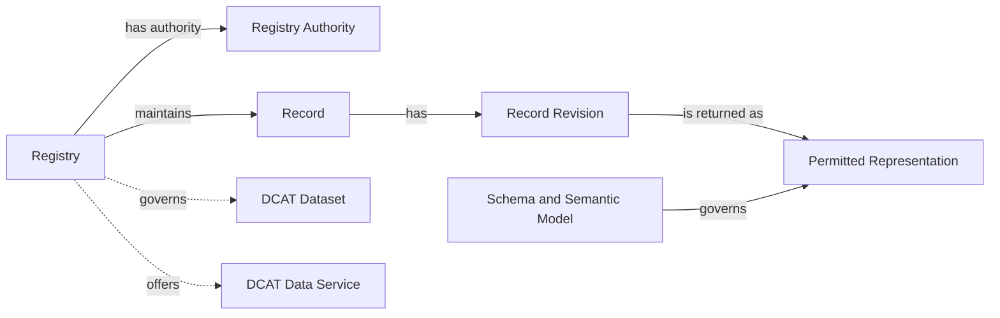

# Registry Core

> **Status:** The Registry Core requirements are DRAFT and form part of the target Base Registry Profile. They do not establish a certification claim in this release.

## Purpose and applicability

Registry Core is the shared foundation for every Digital Registries capability. It is not an API family. It defines how an implementation identifies the Registry and its authority and how returned Records identify their schema, semantic model, revision, lifecycle state, and minimum provenance.

Every Registry implementation publishes its current metadata. [Provisioning](provisioning.md) can optionally provide an administrative interface for creating or revising that metadata, but Provisioning is not required for publication and does not establish the Registry Authority.

## Conceptual model



The model describes externally observable concepts rather than database tables, internal modules, or a deployment topology. An implementation can operate one Registry or many Registries and can expose one or more technical services without changing the meaning of the Registry itself.

## Registry metadata

The Registry metadata description identifies the institutionally governed Registry. It keeps the Registry distinct from its governed datasets, technical interfaces, and any catalogue in which it is listed.

### Minimal metadata

| Concept | Status | RDF alignment | Meaning |
|---|---|---|---|
| Registry Identifier | Required | Registry resource IRI | Globally unique and stable identifier for the Registry. |
| Registry Name | Required | [`dct:title`](https://www.dublincore.org/specifications/dublin-core/dcmi-terms/#title) | Human-readable name used by adopters and consumers. |
| Registry Authority | Required | `govreg:authority` with a [`prov:Agent`](https://www.w3.org/TR/prov-o/#Agent) value | Institution accountable for the Registry and its declared authoritative scope. |
| Digital Registries specification version | Required | [`dct:conformsTo`](https://www.dublincore.org/specifications/dublin-core/dcmi-terms/#conformsTo) | Versioned Digital Registries specification implemented by the service. |
| Description | Optional | [`dct:description`](https://www.dublincore.org/specifications/dublin-core/dcmi-terms/#description) | Human-readable description of the Registry and its scope. |
| Governed dataset | Optional and repeatable | `govreg:dataset` with a [`dcat:Dataset`](https://www.w3.org/TR/vocab-dcat-3/#Class:Dataset) value | A governed collection of Registry Records described for discovery or exchange. |
| Data service | Optional and repeatable | `govreg:dataService` with a [`dcat:DataService`](https://www.w3.org/TR/vocab-dcat-3/#Class:Data_Service) value | A technical interface that provides access to Registry data or operations. |

The proposed GovStack vocabulary is intentionally small:

| Term | Meaning |
|---|---|
| `govreg:Registry` | A specialisation of `dcat:Resource` for an institutionally governed system that maintains authoritative Records within a declared scope. |
| `govreg:authority` | Relates a Registry to the institution accountable for it and its authoritative scope. |
| `govreg:dataset` | Relates a Registry to a governed collection described as a DCAT Dataset. |
| `govreg:dataService` | Relates a Registry to a technical interface described as a DCAT Data Service. |

The companion [Turtle vocabulary](registry-core-vocabulary.ttl) provides machine-readable definitions of these terms and the API-family concept scheme. It keeps the vocabulary separate from the instance data in the example below.

The selected publication namespace is the dedicated `vocab.govstack.global` host. The Registry Core namespace document is `https://vocab.govstack.global/digital-registries`, and the API-family concept-scheme document is `https://vocab.govstack.global/digital-registries/api-families`. Terms use fragment IRIs so each small vocabulary can be retrieved as one document. These version-independent IRIs remain stable when the vocabulary evolves.

> **Editorial note:** Before release, GovStack needs to provision the namespace host so that both namespace documents dereference. This note can be removed once the host is operational.

The namespace can provide HTML, Turtle, and JSON-LD representations through HTTP content negotiation without changing the term IRIs. The companion Turtle file does not require Registry implementations to publish Turtle or claim RDF conformance. This release does not define a SHACL shape.

The versioned [JSON-LD context](registry-core-context.jsonld) is assigned the publication URI `https://vocab.govstack.global/digital-registries/context/v1`. When the vocabulary host is provisioned, this URI serves the context with the `application/ld+json` media type. Context versions are immutable because changing a context can change how existing JSON is interpreted. Versioning the context does not version or otherwise change the vocabulary term IRIs.

### DCAT composition

The [Data Catalog Vocabulary 3](https://www.w3.org/TR/vocab-dcat-3/) describes the resources around a Registry rather than replacing the Registry concept:

- the institutionally governed Registry is a `govreg:Registry`;
- each governed collection can be a [`dcat:Dataset`](https://www.w3.org/TR/vocab-dcat-3/#Class:Dataset);
- each technical API or query interface can be a [`dcat:DataService`](https://www.w3.org/TR/vocab-dcat-3/#Class:Data_Service); and
- a directory that lists Registries can be a [`dcat:Catalog`](https://www.w3.org/TR/vocab-dcat-3/#Class:Catalog).

The base model does not require a Registry to operate its own catalogue. A national or sector directory can catalogue Registry descriptions, datasets, or services maintained by multiple authorities.

### API family discovery

A `dcat:DataService` can identify the Digital Registries API families that it supports using [`dct:type`](https://www.dublincore.org/specifications/dublin-core/dcmi-terms/#type). Each value is a concept from the **Digital Registries API Families** concept scheme. The `apif:` prefix abbreviates the concept namespace.

| Concept | API family |
|---|---|
| `apif:consultation` | Consultation |
| `apif:provisioning` | Provisioning |
| `apif:evidence` | Evidence |
| `apif:write` | Write |
| `apif:notification` | Notification |
| `apif:aggregate-data` | Aggregate Data |
| `apif:access-transparency` | Access Transparency |
| `apif:identity-federation` | Identity Federation |

An API-family type means that the Data Service exposes at least one operation assigned to that family. It does not imply support for every capability pattern in the family and does not establish a GovStack conformance claim. The service's `dcat:endpointDescription` identifies the operational contract and exact operations. A separate `dct:conformsTo` statement identifies a formal profile that the service claims to satisfy.

### Discovery publication

Registry metadata and API discovery serve related but distinct purposes. A Registry description identifies the governed Registry and its authority. An API catalogue provides an entry point for finding the technical interfaces published on an HTTPS origin.

An implementation can publish its canonical DCAT catalogue at a stable HTTPS URI. The recommended default is the root-relative `/catalog` URI on the public API origin, with DCAT representations available through HTTP content negotiation. The catalogue can describe one or more Registries, their governed datasets, and their data services. The catalogue URI is not itself a Registry Identifier, and deployments can select a different stable path.

For standardised API discovery, an implementation can use [RFC 9727, *api-catalog: A Well-Known URI and Link Relation to Help Discovery of APIs*](https://www.rfc-editor.org/rfc/rfc9727.html). RFC 9727 defines `/.well-known/api-catalog` and the `api-catalog` link relation. It provides indirection from the well-known URI to the deployment's canonical catalogue, whether that catalogue is published at `/catalog` or another path. A deployment using RFC 9727 follows its GET, HEAD, HTTPS, and [`application/linkset+json`](https://www.rfc-editor.org/rfc/rfc9264.html) requirements.

The current alpha treats this publication layout as discovery guidance rather than an additional Registry Core conformance requirement. A future HTTP and metadata binding can define required representations, content negotiation, caching, access policy, and validation.

### Informative JSON-LD example

The following JSON-LD document describes one business Registry, accountable authority, governed dataset, and three services supporting the Consultation, Write, and Evidence API families. It references the versioned GovStack context, which maps readable JSON property names to the RDF vocabulary and identifies properties whose values are IRIs. The versioned GovStack specification IRIs are illustrative because this alpha does not publish canonical IRIs for them.

```json
{
  "@context": "https://vocab.govstack.global/digital-registries/context/v1",
  "@graph": [
    {
      "@id": "https://registry.example/catalog",
      "@type": "dcat:Catalog",
      "title": "Business Registry catalogue",
      "description": "Discovery metadata for the Business Registry, its dataset, and its APIs.",
      "publisher": "https://registry.example/organisations/business-authority",
      "catalogResource": "https://registry.example/registries/business",
      "catalogDataset": "https://registry.example/datasets/business-records",
      "catalogService": [
        "https://registry.example/services/business-retrieve",
        "https://registry.example/services/business-write",
        "https://registry.example/services/business-evidence"
      ]
    },
    {
      "@id": "https://registry.example/registries/business",
      "@type": [
        "govreg:Registry",
        "dcat:Resource"
      ],
      "title": "Business Registry",
      "description": "Registry maintained for authoritative business registration records.",
      "conformsTo": "https://specs.govstack.example/digital-registries/3.0.0-alpha.2",
      "authority": "https://registry.example/organisations/business-authority",
      "governedDataset": "https://registry.example/datasets/business-records",
      "dataService": [
        "https://registry.example/services/business-retrieve",
        "https://registry.example/services/business-write",
        "https://registry.example/services/business-evidence"
      ]
    },
    {
      "@id": "https://registry.example/organisations/business-authority",
      "@type": "prov:Organization",
      "title": "Business Registration Authority"
    },
    {
      "@id": "https://registry.example/datasets/business-records",
      "@type": "dcat:Dataset",
      "title": "Business registration records dataset",
      "description": "Governed collection of business registration Records.",
      "publisher": "https://registry.example/organisations/business-authority"
    },
    {
      "@id": "https://registry.example/services/business-retrieve",
      "@type": "dcat:DataService",
      "title": "Business Registry Retrieve API",
      "description": "Retrieves the current permitted representation of a business Record.",
      "conformsTo": "https://specs.govstack.example/digital-registries/3.0.0-alpha.2",
      "serviceType": "apif:consultation",
      "servesDataset": "https://registry.example/datasets/business-records",
      "endpointURL": "https://registry.example/api/business",
      "endpointDescription": "https://registry.example/contracts/business-retrieve.openapi.json"
    },
    {
      "@id": "https://registry.example/services/business-write",
      "@type": "dcat:DataService",
      "title": "Business Registry Write API",
      "description": "Accepts governed requests to create or revise business Records.",
      "conformsTo": "https://specs.govstack.example/digital-registries/3.0.0-alpha.2",
      "serviceType": "apif:write",
      "endpointURL": "https://registry.example/api/business/write",
      "endpointDescription": "https://registry.example/contracts/business-write.openapi.json"
    },
    {
      "@id": "https://registry.example/services/business-evidence",
      "@type": "dcat:DataService",
      "title": "Business Registry Evidence API",
      "description": "Produces signed assertions derived from permitted business registration information.",
      "conformsTo": "https://specs.govstack.example/digital-registries/3.0.0-alpha.2",
      "serviceType": "apif:evidence",
      "endpointURL": "https://registry.example/api/business/evidence",
      "endpointDescription": "https://registry.example/contracts/business-evidence.openapi.json"
    }
  ]
}
```

The example uses untagged strings for readability. Deployments can use JSON-LD language maps, such as `"title": {"en": "Business Registry"}`, when publishing multilingual labels.

The Registry is also typed as [`dcat:Resource`](https://www.w3.org/TR/vocab-dcat-3/#Class:Resource) so that the catalogue can list it with [`dcat:resource`](https://www.w3.org/TR/vocab-dcat-3/#Property:catalog_resource). This does not make the Registry a dataset or a data service. The vocabulary expresses `govreg:Registry` as a subclass of `dcat:Resource`, while explicit dual typing keeps an instance understandable without ontology inference.

The relationships have different scopes. `dcat:resource`, `dcat:dataset`, and `dcat:service` state what is listed in this catalogue. `govreg:dataset` and `govreg:dataService` state which datasets and services belong to this Registry. `dcat:servesDataset` states which dataset a technical service exposes, when applicable.

The `dct:type` statements let a client discover that the catalogue exposes Consultation, Write, and Evidence services. The client follows each service's `dcat:endpointDescription` to determine which operations are available and how to invoke them.

The same graph pattern covers common deployment arrangements:

- a single-Registry deployment publishes one Registry, its datasets, and its services in the catalogue;
- a multi-Registry implementation adds more Registry resources and their related datasets and services to the same catalogue; and
- an aggregating national catalogue can list resources from multiple Registry Authorities or use [`dcat:catalog`](https://www.w3.org/TR/vocab-dcat-3/#Property:catalog_catalog) to include catalogues published by those authorities.

The catalogue contains descriptive metadata only. It does not publish the protected Records contained in a governed dataset.

### Client discovery workflow

A client can discover supported API families without knowing an implementation's API paths in advance:

1. Locate the canonical catalogue from a configured URI, the optional RFC 9727 well-known resource, or the recommended `/catalog` convention.
2. Retrieve a supported RDF representation of the catalogue, such as JSON-LD.
3. Select the required `govreg:Registry` by its stable Registry Identifier.
4. Follow `govreg:dataService` to each associated `dcat:DataService`.
5. Read each service's `dct:type` values from the Digital Registries API Families scheme, then follow `dcat:endpointDescription` for the exact operations and invocation contract.

The following language-neutral pseudocode illustrates the process for a JSON-LD client:

```text
catalogUri = configuredCatalogUri

if catalogUri is absent:
    catalogUri = discoverCatalogUsingRfc9727(apiOrigin)

if catalogUri is absent:
    catalogUri = resolve(apiOrigin, "/catalog")

catalog = loadJsonLd(catalogUri)
registry = catalog.resourceWithId(requiredRegistryId)
supportedCapabilities = []

for each serviceReference in asList(registry.dataService):
    service = catalog.resourceWithId(serviceReference)

    for each family in asList(service.serviceType):
        if DigitalRegistriesApiFamilies contains family:
            supportedCapabilities.append({
                family: family,
                service: resourceIdentifier(service),
                endpoint: service.endpointURL,
                description: service.endpointDescription
            })

return supportedCapabilities
```

Here, `loadJsonLd` applies the versioned context and normalises properties that can contain one or several values. `DigitalRegistriesApiFamilies` is populated from the published [API-family vocabulary](registry-core-vocabulary.ttl), not inferred from an IRI prefix. With the preceding example, the result identifies three Data Services supporting the Consultation, Write, and Evidence families. If a Data Service omits `serviceType`, a client cannot infer API-family support from the catalogue alone, even when its endpoint description happens to contain related operations.

### External alignments

External vocabularies and application profiles can add jurisdictional or discovery semantics without becoming dependencies of Registry Core.

| Alignment | Intended use |
|---|---|
| Schema.org [`Service`](https://schema.org/Service) or [`GovernmentService`](https://schema.org/GovernmentService) | Web discovery when the Registry or its service facet meets the selected Schema.org type. |
| [Core Public Service Vocabulary Application Profile](https://github.com/SEMICeu/CPSV-AP) | Public-service description in implementations using CPSV or CPSV-AP. |
| [BRegDCAT-AP](https://github.com/SEMICeu/BRegDCAT-AP) | European base-registry catalogue interoperability. |
| National or sector profiles | Additional legal, organisational, service, or dataset metadata required by an adopter. |

An adopting profile can add types and properties when their semantics apply. Registry Core does not assert that `govreg:Registry` is universally equivalent to an external service or base-registry class.

## Common Record context

Every returned Record representation carries a common context in addition to its permitted domain data.

| Concept | Purpose |
|---|---|
| Registry Identifier | Identifies the Registry that returned the representation. |
| Record Identifier | Stable reference to the Record within the Registry. |
| Revision Identifier | Identifies the current revision represented by the response. |
| Lifecycle State | State permitted by the declared representation schema. |
| Representation Format | Identifies the serialisation or media type through the applicable binding. |
| Schema Reference | Resolves to the machine-readable structure used to validate the domain data. |
| Semantic Model Reference | Identifies the vocabulary or domain model used to interpret the domain data. |
| Registry Authority | Identifies the institution responsible for the authoritative source. |
| Recorded At | Identifies when the current revision was recorded. |

The applicable capability determines whether a representation contains domain data and which projection the consumer is permitted to receive. Protected metadata can be omitted or redacted only where the applicable representation schema and capability requirements keep the result unambiguous and valid.

## Revisions and lifecycle

The Record Identifier remains stable when a new revision is accepted. Revision identifiers distinguish successive representations of the same Record.

The declared representation schema defines the supported lifecycle-state vocabulary. Terms such as active, inactive, superseded, archived, and deleted are examples, not a mandatory enumeration in this release.

## Domain semantics and extensions

The Digital Registries Building Block does not define a universal person, business, parcel, vehicle, health, or programme schema. Each returned representation identifies its machine-readable schema and published semantic model. An adopter can use an appropriate sector model and map national extensions explicitly.

Extensions do not change the meaning of required Registry or Record metadata. Rules for unknown fields, compatibility, and schema evolution are not defined in this release.

## Registry Core functional requirements

### #1 Publish Registry metadata (DRAFT EXTENSIBLE AUDITABLE)

`govstack-bb-digital-registries-fr-core#req-1`

An implementation publishes machine-readable Registry metadata containing a globally unique and stable Registry Identifier, a human-readable Registry name, the identity of the Registry Authority, and the Digital Registries specification version it implements.

**Purpose:** An adopter can determine which Registry and authority stand behind a service and which versioned requirement set, including its inherited requirements, applies.

**Prerequisite:** The Registry Authority and authoritative scope have been established by the adopting organisation.

**Verification:** Inspect the published Registry metadata, validate that all required values are present, and review evidence that the Registry Identifier is not shared with another Registry or changed between service revisions.

### #2 Identify each returned Record (DRAFT EXTENSIBLE OBSERVABLE)

`govstack-bb-digital-registries-fr-core#req-2`

Every returned Record representation includes the Registry Identifier and a Record Identifier that is unique within that Registry. Together, the two identifiers uniquely identify the Record.

**Purpose:** Consumers can distinguish Records from different Registries and refer to one Record without depending on mutable domain attributes.

**Prerequisite:** A Record has been accepted into the Registry.

**Verification:** Retrieve two distinct Record fixtures and verify that each response carries the expected Registry Identifier and a different Record Identifier.

### #3 Preserve Record Identifiers (DRAFT EXTENSIBLE AUDITABLE)

`govstack-bb-digital-registries-fr-core#req-3`

An implementation keeps a Record Identifier unchanged throughout that Record's lifecycle and revisions and never reassigns the identifier to a different Record.

**Purpose:** A Record reference remains unambiguous after changes, retirement, archival, or deletion.

**Prerequisite:** The implementation has a documented Record Identifier lifecycle policy.

**Verification:** Review the identifier policy and evidence showing that successive revisions retain the same identifier, distinct Records do not share an identifier, and retired identifiers are not returned to the allocation pool.

### #4 Identify the Record schema, semantic model, and representation format (DRAFT EXTENSIBLE OBSERVABLE)

`govstack-bb-digital-registries-fr-core#req-4`

Every returned Record representation identifies a resolvable machine-readable schema and the published semantic model that govern its domain data. It also identifies its representation format through the applicable binding.

**Purpose:** Consumers can decode and validate a representation and interpret its domain meaning without knowledge of the implementation's internal storage.

**Prerequisite:** The Registry Authority has selected the applicable representation format, schema, and semantic model.

**Verification:** Retrieve a Record, verify that the representation format conveyed by the binding matches the returned representation, resolve the declared schema, validate the representation, and resolve the semantic-model identifier to its published definition.

### #5 Identify the current revision and lifecycle state (DRAFT EXTENSIBLE OBSERVABLE)

`govstack-bb-digital-registries-fr-core#req-5`

Every returned Record representation identifies its current revision and a lifecycle state permitted by the representation's declared schema.

**Purpose:** Consumers can distinguish the current representation from earlier revisions and interpret its declared state.

**Prerequisite:** The selected representation schema defines the supported lifecycle-state vocabulary.

**Verification:** Retrieve fixtures in each lifecycle state exposed through Consultation, validate each state against the declared schema, and verify that each response identifies a current revision.

### #6 Provide minimum Record provenance (DRAFT EXTENSIBLE OBSERVABLE)

`govstack-bb-digital-registries-fr-core#req-6`

Every returned Record representation identifies the Registry Authority as the responsible source and provides the time at which the current revision was recorded.

**Purpose:** A consumer can assess the institutional source and currency of the authoritative information.

**Prerequisite:** The Registry captures provenance for each accepted revision.

**Verification:** Retrieve a Record and verify that the representation contains the Registry Authority identifier and recording time. Additional protected provenance details are outside this minimum requirement.
