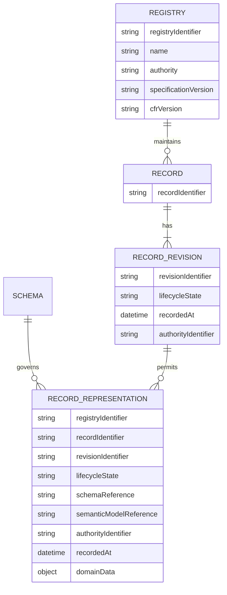

# 8 Data Structures

## 8.1 Scope

This chapter describes the information that crosses the Base Registry Profile boundary. It does not prescribe database tables, field storage, entity-attribute-value structures, or an internal audit-log implementation.

The names below are conceptual. This release does not define exact JSON property names or a canonical schema.

## 8.2 Conceptual model

## 8.3 Registry metadata

| Concept | Purpose |
|---|---|
| Registry Identifier | Globally unique and stable identifier for the Registry. |
| Registry Name | Human-readable name used by adopters and consumers. |
| Registry Authority | Institution accountable for the declared authoritative scope. |
| Specification Version | Digital Registries specification implemented by the service. |
| CFR Version | GovStack Common Requirements Framework version implemented by the service. |

The capability-discovery format is not specified in this release.

## 8.4 Record representation

| Concept | Purpose |
|---|---|
| Registry Identifier | Identifies the Registry that returned the representation. |
| Record Identifier | Stable reference to the Record within the Registry. |
| Revision Identifier | Identifies the current revision represented by the response. |
| Lifecycle State | State permitted by the declared representation schema. |
| Schema Reference | Resolves to the machine-readable structure used to validate domain data. |
| Semantic Model Reference | Identifies the vocabulary or domain model used to interpret the data. |
| Minimum Provenance | Identifies the Registry Authority as the responsible source and the time at which the current revision was recorded. |
| Domain Data | The authorised projection of domain-specific Record content. |

The permitted representation may omit or redact domain data and additional protected provenance. The Registry Core requirements identify which metadata is present in every returned representation. The applicable representation schema accounts for permitted omissions so that the response remains unambiguous and valid.

## 8.5 Revisions and lifecycle

The Base Registry Profile retrieves the current revision. It does not include an operation for retrieving historical revisions.

The declared representation schema defines the supported lifecycle-state vocabulary. Terms such as active, inactive, superseded, archived, and deleted are examples, not a mandatory enumeration in this release.

The Record Identifier remains stable when a new revision is accepted. Revision identifiers distinguish successive representations of the same Record.

## 8.6 Domain semantics and extensions

The Digital Registries Building Block does not define a universal person, business, parcel, vehicle, health, or programme schema. Each returned representation identifies its machine-readable schema and published semantic model. An adopter can use an appropriate sector model and map national extensions explicitly.

Extensions do not change the meaning of required Registry metadata. Rules for unknown fields, compatibility, and schema evolution are not defined in this release.
