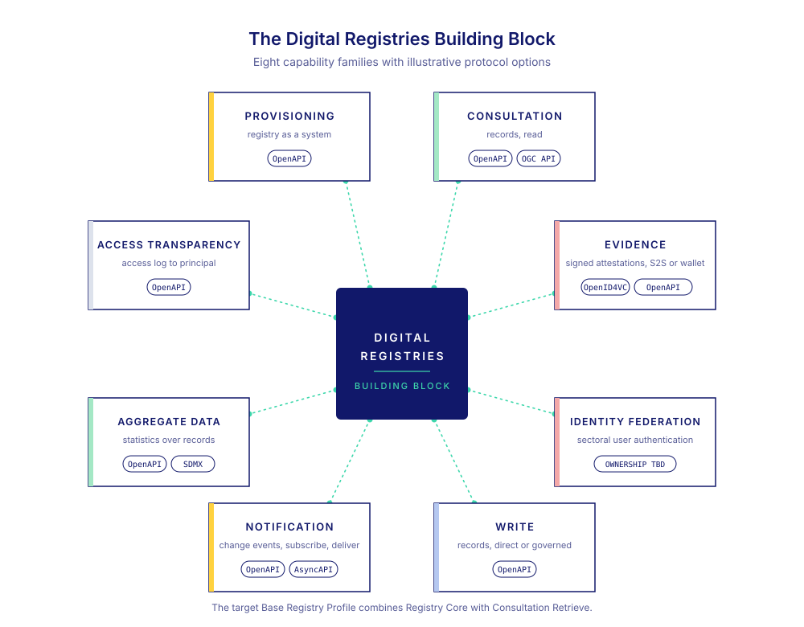

# Digital Registries Building Block Specification

`govstack-bb-digital-registries-3.0.0-alpha.2 extends govstack-cfr-2.1.0`

> **Alpha specification.** Its requirements are classified as DRAFT and do not establish a GovStack certification claim. Implementers should use the latest approved Digital Registries specification for procurement or certification.

The Digital Registries Building Block defines interoperable behaviour for software that maintains authoritative records about persons, organisations, places, assets, or events. It specifies a minimum Base Registry Profile and a catalogue of additional capabilities that an implementation may support.

The Base Registry Profile consists of Registry Core behaviour and the ability for an authorised API consumer to retrieve the current permitted representation of a record by its stable identifier. The specification does not prescribe a database product, administrative user interface, storage model, deployment topology, or domain data model.

## How to use this specification

- **Government architects** should begin with [Description and Scope](2-description-and-scope.md) and [Conformance](4-conformance.md) to determine where a Registry fits within a digital government architecture.
- **Procurement teams** can use the alpha to understand the intended profile structure, but should cite an approved specification version in a tender or acceptance contract.
- **Implementers** can use the DRAFT requirements, data structures, and workflow for prototyping. This alpha does not publish an implementation contract.
- **Conformance testers** can use [Testing](11-testing.md) to assess verification intent. This alpha does not publish a conformance suite or permit capability claims.

## Status and authorship

This alpha is structured around a domain-neutral Registry Core, mandatory Consultation Retrieve, and optional capability families. Earlier contributions, authors, coordinators, editors, and reviewers remain recorded in the [Version History](1-version-history/README.md) and [Release Notes](1-version-history/release-notes.md).

_**Coordinating authors of the 3.0.0-alpha.1 work:**_ Dr. Bimal Kumar, Xilene Siquero, and Sebastian Leidig

_**Authors:**_ Janet Ngugi, Vivek Rana, Chinenye Ifebirinachi, Ananya Jha, Umang Gupta, Leonora Smart-Abbey, and Jeremi Joslin

_**Editors:**_ Ali González-García and David Higgins

_**First version by:**_ Frank Grozel, Ingmar Vali, Tambet Artma, Saurav Bhattarai, Dr. P. S. Ramkumar, Rauno Kulla, and Sebastian Leidig

<figure><figcaption>The target Base Registry Profile combines Registry Core with Consultation Retrieve.</figcaption></figure>
